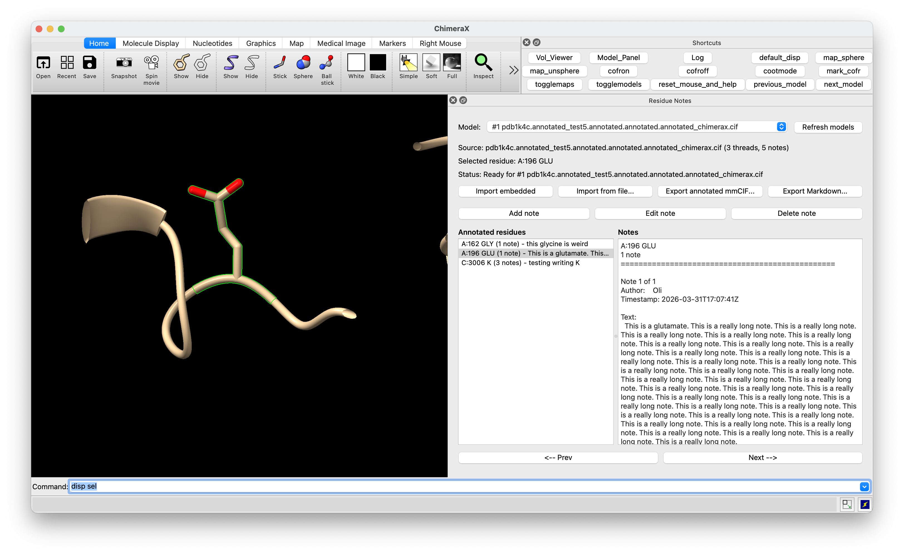

# ChimeraX Residue Notes

Prototype ChimeraX bundle for reading and writing custom
`_cootnote_residue_note.*` mmCIF annotations written by `coot1_trimmings`.

Current scope:
- open a `Residue Notes` tool window
- auto-import embedded notes from an mmCIF source file when possible
- browse annotated residues and jump to them in ChimeraX
- add, edit, and delete notes
- follow the current single selected residue, or fall back to the residue closest to CoFR
- export an annotated mmCIF by saving the current model as mmCIF and then patching in the note loop
- export the current note set as a plain Markdown table

Notes:
- this bundle stores notes in the same on-disk format as Coot:
  - `_cootnote_residue_note.author_b64`
  - `_cootnote_residue_note.note_b64`
- `author` and `note` are Base64-encoded UTF-8 text for robust round-tripping
- the mmCIF reader/writer is intentionally focused on the custom note loop and patches the text file directly

## Install
Download the bundle (whole `chimerax-residue-notes` folder), then:

In ChimeraX:

```chimerax
devel install /my/path/to/chimerax-residue-notes
```

Then in ChimeraX, type resnotes, and the tool should appear. I've included an example cif file with some notes so you can see how it works:



## Caveats

- This is still a lightweight bundle and would benefit from broader testing on larger models and more varied mmCIF sources.
- The note loop parser assumes the Coot-written schema and simple token values for the custom loop rows.
- Export is explicit via the tool; it does not attempt to modify ChimeraX's default save behavior.
- Prototype generated with the assistance of the Codex LLM.
